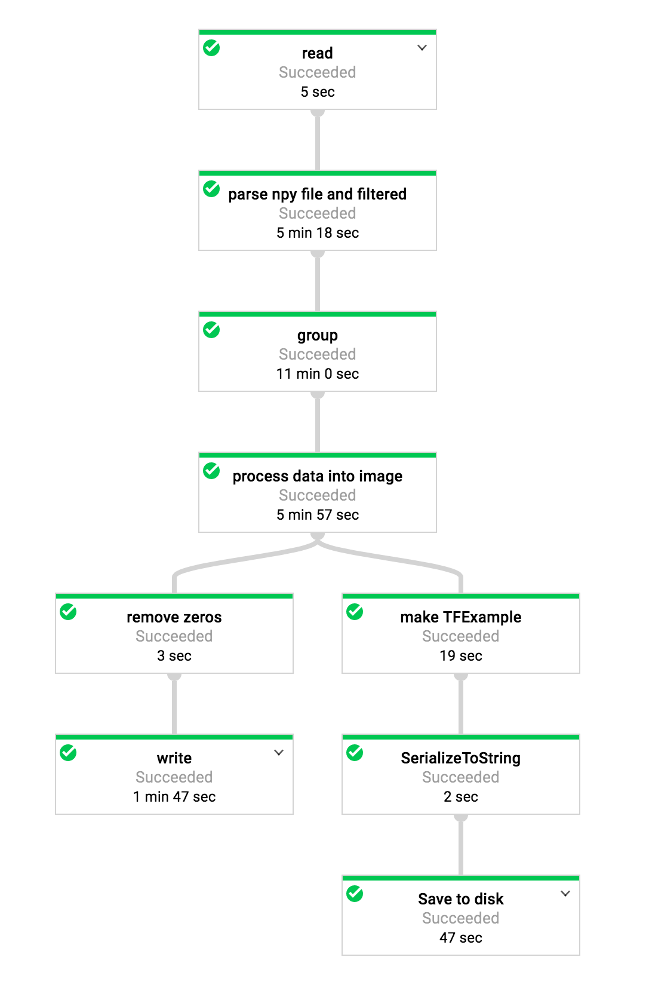
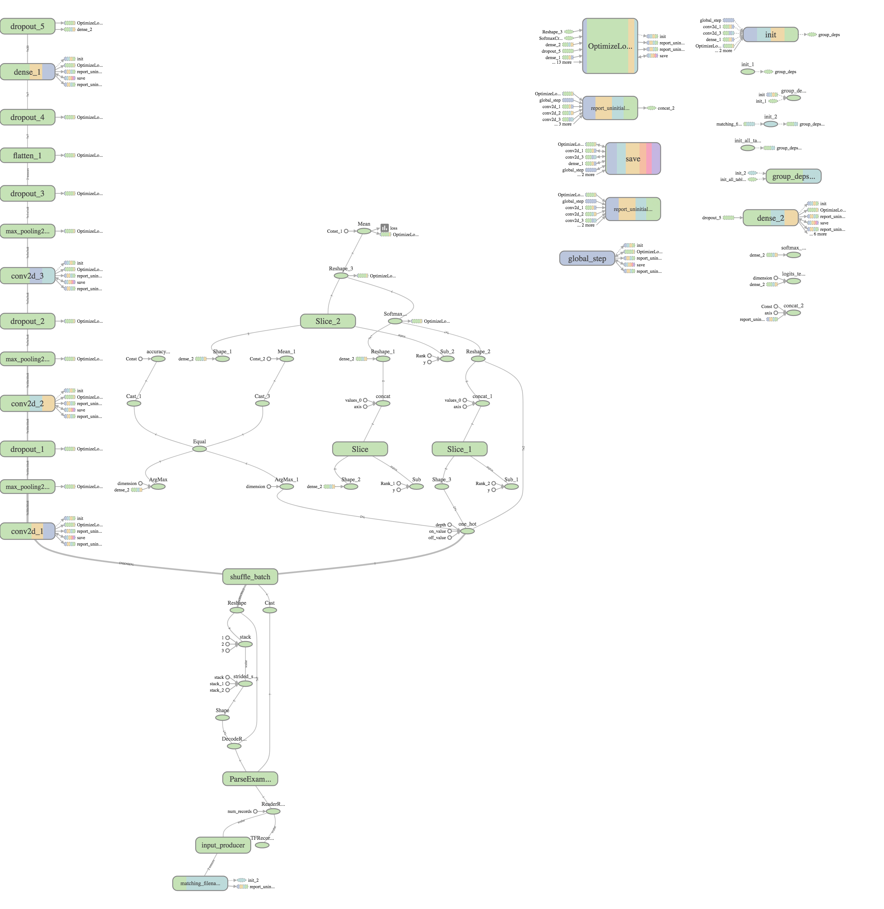
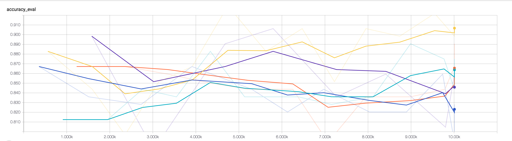
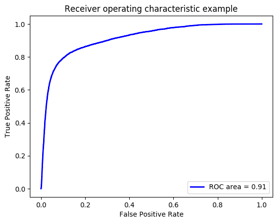

# Identifying a Particle Using Convolutional Neural Network and Google Cloud Platform

## The data and my goal
 * What do we get from the CMS detector?
	 * The [CMS detector](https://cms.cern/detector) like a giant digital camera taking pictures of particles passing through it. When interacting with the detector materials, the particles deposit energy and expose their positions which are recorded, digitizied and stored. Some algorithms are used to connect the digital signals in different detector parts to identify some very basic types of stable particles, e.g., electron and pion. However more advanced methods are needed to identify heavier particles that decay to multiple of the stable particles. **This is the primary goal of the work done here, i.e., to identify a heavy W boson particle** (similarly can be extended to other particles).
 * What are the content in the data? And what features does it have?
 	* The data I use come from the public dataset from the CMS collaboration. They are simulated events with detailed detector configuration and setup. Therefore we know the answer whether the bunch of particles we look at come from the decay of a specific heavier particle.
 	* Given enough boost of a particle, all its decay product will concentrate in a confined region within a solid angle. Here I only consider the 2D projected sphere as our "picture" which is an analogy to our printed pictures in books and magazines. The size convention does not matter but we have a keyword "ak7" for all the related qualities.
 	* The pictures of the signal (targeted W boson particle) and other noise can be viewed in this [jupyter notebook](cnn_toptagger.ipynb) (they are averaged over many of them). Here I use the particle energy as a measure of the intensity level (for a cell/"pixel") and particle charges as the channels (analogy to the RGB channels).
 * Why convolutional neural network?
 	* Given the similarity between the CMS detector data and our everyday photos, it is a good starting point to consider the convolutional neural network which works very well for imagine recognition.
 
## General project design consideration
 * Given I have roughly 5 million original data items to process, I use Google Cloud Dataflow service for data pre-processing pipeline for distributed computing. In practice, there could be much more data to pre-process for this or other tasks.
 * I also need distributed training and some hyper-parameter tuning to find the best solution in reasonable amount of time.
 * I use high level tensorflow and Keras API to quickly build the network and training pipeline so that I can experiment with different settings and network structures more easily.
 
## Data pre-processing pipeline
 * The data pre-processing is done using Google Cloud Dataflow service with the Beam framework. The source files (in npy format) are copied to a Google Cloud Storage bucket gs://jetimage-source-files/ and divided into train and test parts.
 * Two csv files are used to compile all the file location in Google Cloud Storage bucket and some label/notation information:
	* gs://jetimage-source-files/filenames\_gcloud\_train.csv
	* gs://jetimage-source-files/filenames\_gcloud\_test.csv
 * The output files in compressed tfrecords format are in gs://jetimage-tfrecords bucket
 * The pipeline is defined in the [preprocess.py](trainer/preprocess.py) file in Beam framework (a similar [Spark code](trainer/preprocess_in_spark.py) is also prepared). The major parts in the pipeline is to apply selection cuts and assign correct labels (the ReadFileAndConvert function), convert the raw information of particles to an image (the ProcessImage function), and convert the image (in numpy array) to tfrecords (the TFExampleFromImage function) so that they can be used by the ML Engine as input. The flow chart can be viewed as follows:

## Covnet definition and training
 * The definition of the model is coded in [model.py](trainer/model.py). Function build\_conv\_model uses Keras API to define the Covnet structure with couple of tuning parameters. The build\_read\_and\_decode\_fn provides input batches with images and labels for both training and testing. The model\_fn defines the loss, optimization method and evaluation metrics. 
 * The [task.py](trainer/task.py) file controls the training pileline where a tf.contrib.learn.Experiment is used to handle the training and evaluation loops for distributed training.
 * The training results are stored in gs://cnn-tagger/* including the exported model.
 * The structure of the Covnet and training flow chart is extracted from the tensorboard monitor below.

 

## Hyper-parameter tuning
 * As a simple example, I show the tuning of the learning_rate which is one of the most important hyper-parameters. The definition of the tuning parameters are in the [hptuning_config.yaml](hptuning_config.yaml) file. 
 * A scan of 5 different learning_rate is shown below. The default value chosen was 1e-4, however a better one is found to be 0.000786 (orange line) which provides an improved accuracy! (Note that the 5 values tried are [0.003, 0.00001, 0.10, 0.00051, 0.000786].)

 * After couple of other tuning of various parameters, I end up with accuracy over 90% which improves from around 80% accuracy using some initial values. The AUC score is over 0.9.

## Prediction Service
 * The production level version (v1) of training results are located at gs://cnn-tagger/prod-v1 bucket. The exported model is in gs://cnn-tagger/prod-v1/export/Servo/1496207134.
 * I setup a prediction service and run an online prediction for 10 examples provided in this [json](predict_test_more.json) file. The output is the following:
   <pre>
	[0.9843168258666992, 0.01568314991891384]
	[0.9562500715255737, 0.04374995082616806]
	[0.8877395391464233, 0.11226039379835129]
	[0.4262990355491638, 0.5737009644508362]
	[0.9478381276130676, 0.052161894738674164]
	[0.7467820048332214, 0.2532179653644562]
	[0.4128965139389038, 0.5871034860610962]
	[0.9525721073150635, 0.04742792248725891]
	[0.9301067590713501, 0.06989321857690811]
	[0.9325234293937683, 0.06747651845216751]
   </pre>
   where the numbers are probablities to be 0 (noise background) or 1 (signal object). And the predicted class of each sample is exactly what we expect (with a prob. threshold at 0.5).
 * I load the exported model (v1) locally in the [serving.py](trainer/serving.py). Using the test samples, I inspect the ROC as follows. As can be seen the AUC score is over 0.9 and the ROC looks good. By selecting different point in the curve, we can try to meet our desired (TPR, FPR) requirement.

 

 
 

