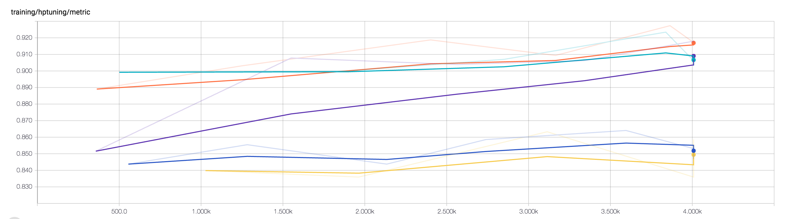

# Predicting a W Boson Object Using a Convolutional Neural Network and Google Cloud Platform

(WORK IN PROGRESS)

## The original data and my goal
 * What we get from the CMS detector?
 * What we have in the data?
 * Some features
 * Why CNN?
 
## General consideration
 * Use cloud computing for massive parralel data pre-process and neural network training
 * Distributed training and hyper-parameter tuning
 * Quick build-up of the CNN and training pipeline
 
## The data pre-processing pipeline

## The CNN network

## The hyper-parameter tuning

